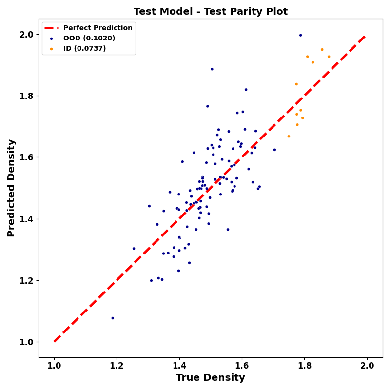

# BOOM
Data preparation utilities and experiments for out-of-distribution predictions of molecule properties

## Overview

Data-driven molecule discovery leverages machine learning (ML) and generative modeling to filter and design novel molecules. Discovering novel molecules requires accurate out-of-distribution (OOD) predictions, but ML models struggle to generalize OOD. Currently, no systematic benchmarks exist for molecular OOD prediction tasks. We present BOOM, benchmarks for out-of-distribution molecular property predictions: a benchmark study of property-based OOD models for common molecular property prediction. We evaluate over 140 model-task combinations to benchmark deep learning models on OOD performance. Overall, we find no existing models achieve strong OOD generalization across all tasks: even the top model exhibited an average OOD error 3x larger than in-distribution. Current chemical foundation models do not show strong OOD extrapolation, while models with high inductive bias can perform well on OOD tasks with simple, specific properties. We perform extensive ablation experiments, highlighting how data generation, pre-training, hyperparameter optimization, model architecture, and molecular representation impact OOD performance. Developing models with strong OOD generalization is a new frontier challenge in chemical ML. 

# Installation
## Requirements
The base requirements are:
- Python 3.8+
- Numpy
- Scikit-learn
- PyTorch
- RDkit
- Matplotlib
- Seaborn
- tqdm


## From local source
Clone the repository and install the package in editable mode. 
```bash 
git clone 
pip install -e .
```

# Data Preparation
The data should be already in the repo and should not be processed individually. 
We set the random seed, but that may not guarantee the same results. So highly recommended to **not** run the data preparation code again. 

If you still want to run the data preparation code, you can run the following command. 
```python
from boom.data import prepare_data

prepare_data(density_file=<density_file_location>,
             hof_file=<hof_file_location>,
             output_dir=<output_dir>,)
```

# Usage

## Datasets
The generic SMILES dataset class lets you load a particular property and split:

```python
from boom.data.SMILESDataset import SMILESDataset

data = SMILESDataset(property=<property>, 
                     split=<split>)
```
The defaults for the class should work as is and shouldn't require any additional arguments but custom dataset file location can be provided with `split_file`.

The `property` argument can be one of the following:
- `density`
- `hof`
- `alpha`
- `homo`
- `lumo`
- `gap`
- `r2`
- `cv`
- `mu`
- `zpve`


The `split` argument can be one of the following:
- `train`
- `id`
- `ood`

The `split_file` argument can be used to provide a custom dataset file location.

The property and split can be combined to get the desired dataset. For example, to get the training dataset for density property:

```python
from boom.datasets.SMILESDataset import TrainDensityDataset, IIDDensityDataset, OODDensityDataset

training_data = TrainDensityDataset()
id_test_data = IIDDensityDataset()
ood_test_data = OODDensityDataset()
```

SMILES data is available for the `10K CSD` and `QM9` datasets.

The `10K CSD` datasets available are:
- `<split>DensityDataset`
- `<split>HoFDataset`

The `QM9` datasets available are:
- `<split>QM9_alphaDataset`
- `<split>QM9_cvDataset`
- `<split>QM9_g298Dataset`
- `<split>QM9_h298Dataset`
- `<split>QM9_homoDataset`
- `<split>QM9_lumoDataset`
- `<split>QM9_gapDataset`
- `<split>QM9_muDataset`
- `<split>QM9_u298Dataset`
- `<split>QM9_zpveDataset`

`<split>` can be one of `Train`, `ID`, or `OOD`.
## Visualization
The visualization module provides a simple way to visualize the data. 

```python
from boom.viz.ParityPlot import DensityOODParityPlot, HoFOODParityPlot
from boom.datasets.SMILESDataset import (
    OODDensityDataset,
    OODHoFDataset,
    IDDensityDataset,
    IDHoFDataset,
)

real_iid_data = OODDensityDataset()
real_ood_data = OODHoFDataset()
true_density_labels = {
  'id': real_data.propety_values
  'ood': real_ood_data.propety_values
}

predicted_iid_labels = model(real_iid_data.smiles)
predicted_ood_labels = model(real_ood_data.smiles)

fake_density_labels = {
  'id': predicted_iid_labels
  'ood': predicted_ood_labels
}
fig = DensityOODParityPlot(true_density_labels, fake_density_labels, title="Density")
```
This generates a plot like: 

