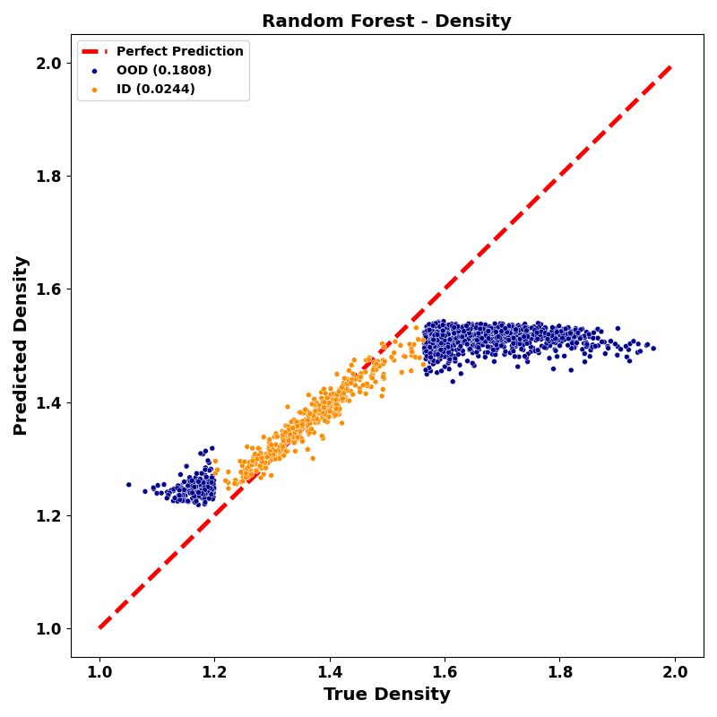
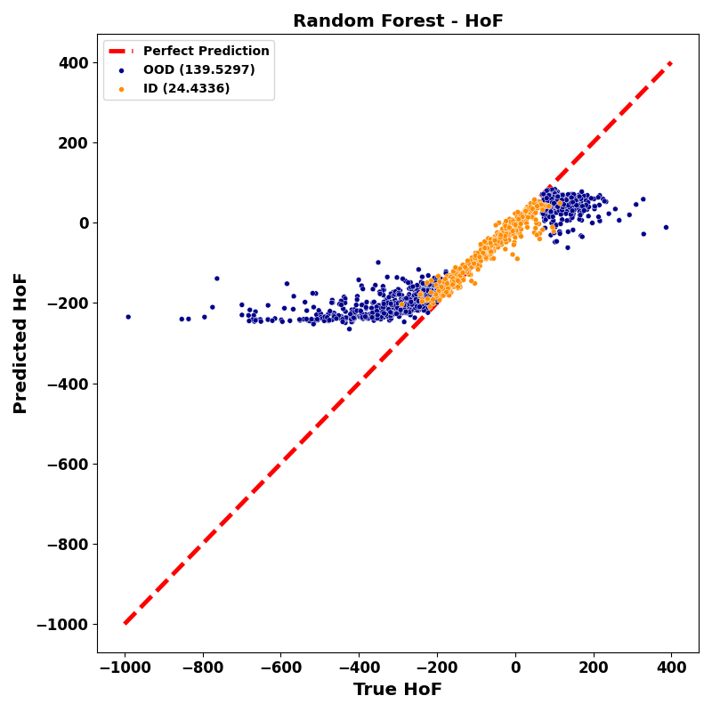

# Random Forest + RDKit feautres

## Installation

The random forest model requires `RDKit` and `deepchem` to be installed. **NOTE: This code currently only works with `deepchem==2.6.1`

Install `deepchem` with pip:

```bash
pip install deepchem==2.6.1
```

Also, `flask_ood` must also be installed of course. 

## Usage
Run all the experiments using the following command:

```bash
python run_experiments.py
```

## Results

### 10K CSD dataset

<p align="center">
 


### QM9 Datasets
<p align="center">
 
 
 
 
 
 
 
 

</p>
